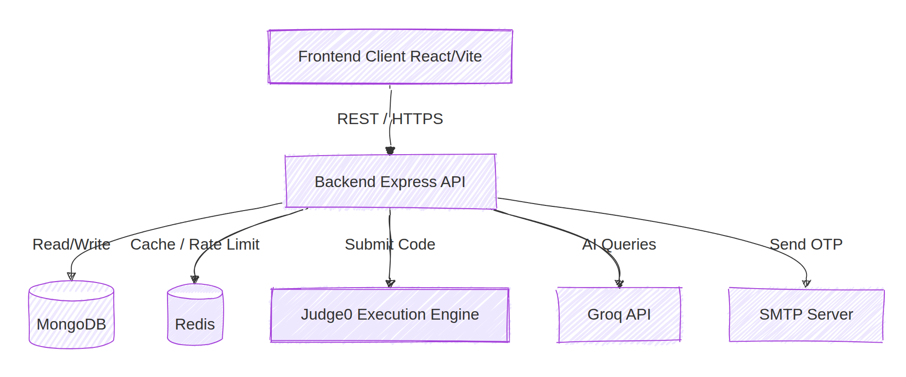
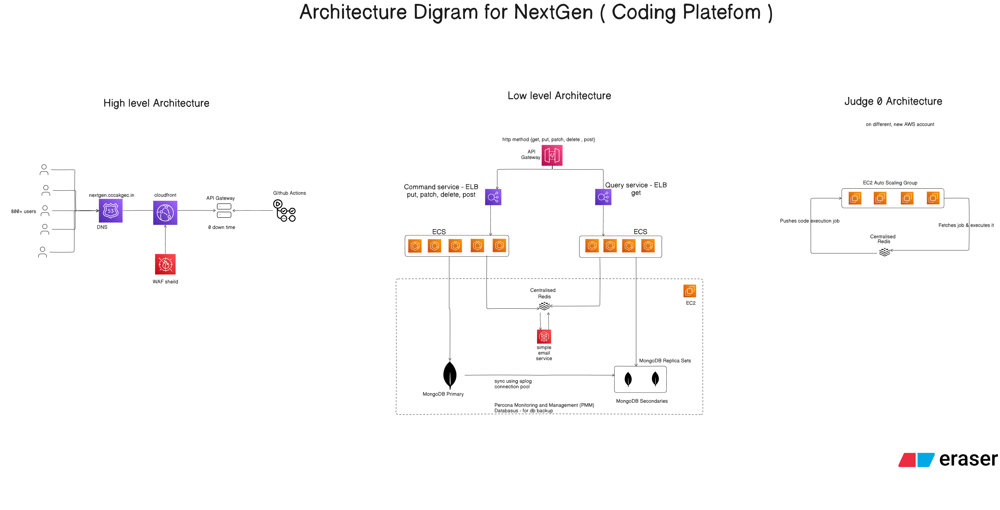

# NextGen Assessment Systems Architecture

This document provides a high-level overview of the architecture and technical design of the NextGen Assessment Systems platform.

## 1. System Overview

NextGen Assessment Systems is a full-stack, scalable online coding and assessment platform. It is built to support high-concurrency "thundering herd" scenarios, enabling hundreds of students to submit assessments simultaneously. 

The system uses a client-server architecture with a separate frontend SPA and a backend RESTful API.

## 2. Technology Stack

### Frontend (Client)
- **Framework:** React 19
- **Build Tool:** Vite
- **Styling:** Tailwind CSS v4
- **State Management:** Redux Toolkit
- **Animations:** Framer Motion
- **Code Editor:** Monaco Editor (Browser-based IDE)

### Backend (Server)
- **Runtime:** Node.js
- **Framework:** Express.js
- **Database:** MongoDB with Mongoose ODM
- **Caching & Rate Limiting:** ioredis (Redis)
- **Authentication:** JWT (JSON Web Tokens)

### External Services
- **Code Execution:** Judge0 (Secure remote execution for hidden test cases)
- **AI Analysis:** Groq API (AI assistance for test cases and logic evaluation)
- **Email:** SMTP (Nodemailer for OTP verification)

## 3. High-Level Architecture Diagram

### Flow Diagram

### CQRS Deployment Architecture

## 4. Key Architectural Patterns

### 4.1 Route Segregation & CQRS-like Pattern
The backend structure separates routes logically, adopting a CQRS (Command Query Responsibility Segregation) style for better maintainability:
- **Command Routes:** Handle state-changing operations (e.g., `adminCommandRoutes.js`, `testCommandRoutes.js`).
- **Query Routes:** Handle data fetching operations (e.g., `adminQueryRoutes.js`, `testQueryRoutes.js`).
- **Event Routes:** Handle event-driven architecture requirements (e.g., `eventRoutes.js`).

### 4.2 High-Concurrency Handling
To manage sudden spikes in traffic (especially when a timed test ends for all candidates simultaneously):
- **Jitter Timers:** The frontend introduces a randomized delay (jitter) between 0-15 seconds for final test auto-submissions to distribute backend load.
- **Save with Retry Logic:** `saveAnswerWithRetry` logic is implemented on the frontend to ensure temporary network blips do not cause data loss. Answers are frequently persisted on "Save & Next" operations.

### 4.3 State Recovery
- **Local Storage Fallbacks:** Along with API syncing, answers are stored in local storage to prevent data loss in the event of severe network failure.

### 4.4 Data Models
- **User / RegistrationUser:** Identity and verification lifecycle management.
- **Test:** Assessment configurations, questions, and constraints.
- **Submission:** Tracks candidate progress, code execution verdicts, and scores.
- **OTP:** Short-lived tokens for email verification.
